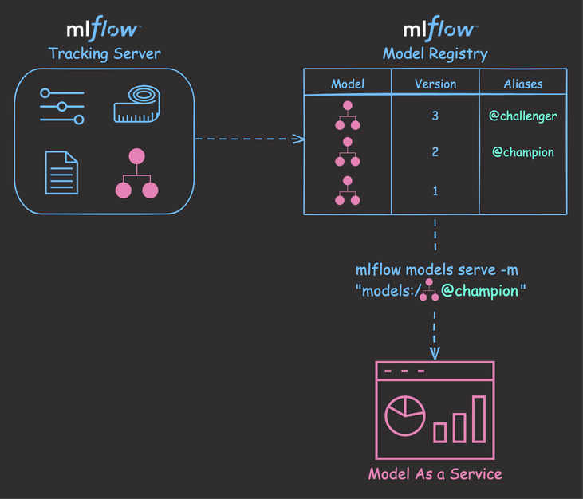
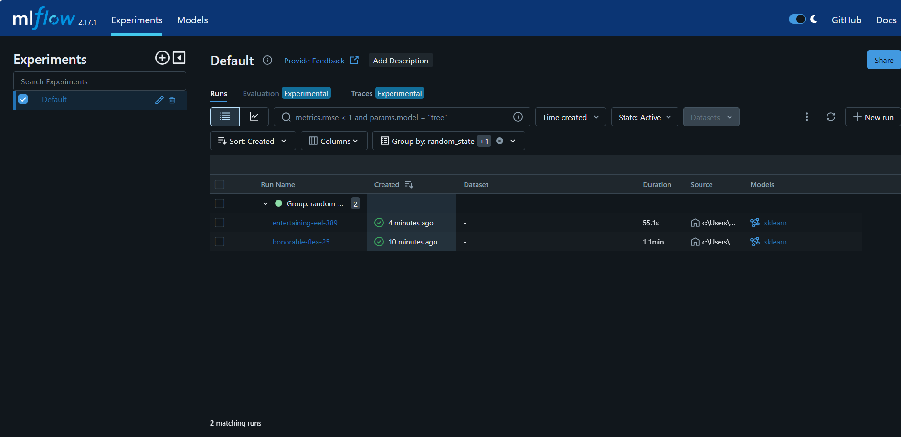
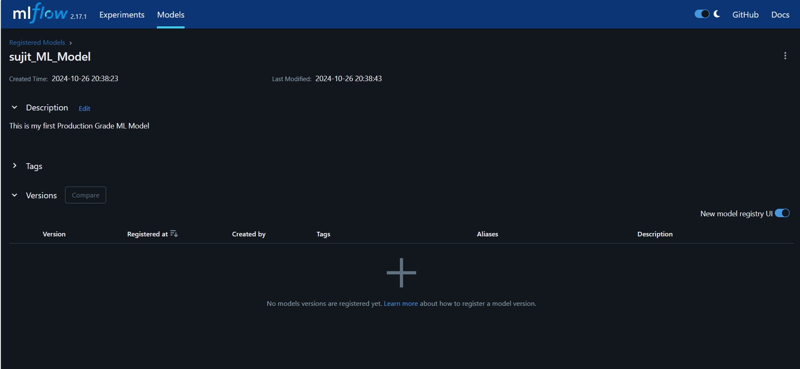

# Learning MLflow: A Comprehensive Journey Through Implementation:





# UI Interface Images :







## Table of Contents:

1. 🛠️ [Setting Up the Environment](#1-setting-up-the-environment)
2. 🔬 [Data Preparation and Model Training](#2-data-preparation-and-model-training)
3. 📈 [MLflow Tracking](#3-mlflow-tracking)
4. 🖥️ [Viewing Results](#4-viewing-results)
5. 🏆 [Conclusion](#conclusion)
6. 💡 [Project Motivation](#project-motivation)
7. 🎯 [Importance and Problem Solving](#importance-and-problem-solving)


## Introduction:

This README documents my in-depth journey of learning and implementing MLflow, a powerful open-source platform for managing the end-to-end machine learning lifecycle. Through hands-on experience and practical application, I've gained valuable insights into how MLflow can streamline the machine learning development process, from experimentation to deployment.

## What is MLflow?

MLflow is an open-source platform designed to manage the complete machine learning lifecycle, including experimentation, reproducibility, deployment, and a central model registry. Its key components include:

1. MLflow Tracking: For logging parameters, code versions, metrics, and artifacts.
2. MLflow Projects: For packaging ML code in a reusable, reproducible form.
3. MLflow Models: For packaging machine learning models that can be used in a variety of downstream tools.
4. MLflow Model Registry: For collaboratively managing the full lifecycle of an MLflow Model.


## Project Implementation

In this project, I implemented MLflow to track experiments for a Random Forest Regressor model using the California Housing dataset. Here's a breakdown of the implementation:

### 1. Setting Up the Environment

Setting up the environment for MLflow involves several steps:

1. Install MLflow:
   - Use pip to install MLflow: `pip install mlflow`
   - This installs the MLflow library and its dependencies.

2. Set up a workspace:
   - Create a new directory for your project.
   - Initialize a virtual environment (optional but recommended):
     ```
     python -m venv mlflow_env
     source mlflow_env/bin/activate  # On Windows, use `mlflow_env\Scripts\activate`
     ```

3. Configure MLflow:
   - By default, MLflow will store runs locally in an `mlruns` directory.
   - For more advanced setups, you can configure a remote tracking server or use cloud storage.

4. Import necessary libraries:
   - In your Python script, import MLflow and other required libraries:
     ```python
     import mlflow
     import mlflow.sklearn
     from sklearn.datasets import fetch_california_housing
     from sklearn.model_selection import train_test_split
     from sklearn.ensemble import RandomForestRegressor
     from sklearn.metrics import mean_squared_error, r2_score
     ```

5. Start using MLflow:
   - Begin an MLflow run in your code:
     ```python
     with mlflow.start_run():
         # Your machine learning code here
         # Log parameters, metrics, and models using MLflow
     ```


### 2. Data Preparation and Model Training

| Step | Description |
|------|-------------|
| Data Loading | Fetch California Housing dataset |
| Data Splitting | Split data into training and testing sets |
| Model Creation | Initialize Random Forest Regressor |
| Model Training | Fit the model on training data |
| Prediction | Make predictions on test data |
| Evaluation | Calculate MSE and R2 score |

### 3. MLflow Tracking

| Action | Description |
|--------|-------------|
| Log Parameters | Record hyperparameters used in the model |
| Log Metrics | Store evaluation metrics (MSE, R2) |
| Log Model | Save the trained model for future use |

### 4. Viewing Results

**Use the MLflow UI to visualize and compare experiment runs:**

- Launch with `mlflow ui` in your terminal
- Access at `http://localhost:5000` in your web browser


## Project Motivation:

**The primary reasons for creating this project are:**

1. To gain hands-on experience with MLflow and understand its capabilities in experiment tracking and model management.
2. To demonstrate best practices in machine learning workflow organization and reproducibility.
3. To create a template for future machine learning projects that incorporates robust tracking and versioning.
4. To explore the California Housing dataset and build a predictive model while showcasing the benefits of using MLflow in the process.

## Importance and Problem Solving:

**The integration of MLflow in this project is crucial for several reasons:**

***
1. Reproducibility: MLflow solves the challenge of reproducing machine learning experiments by tracking all parameters, code versions, and data used in each run.

2. Collaboration: It enables seamless collaboration among team members by providing a centralized platform for sharing experiments and results.

3. Model Versioning: MLflow addresses the issue of model versioning, allowing data scientists to easily track different iterations of their models and compare their performance.

4. Experiment Organization: It provides a structured way to organize and manage multiple experiments, solving the problem of scattered and poorly documented machine learning projects.

5. Deployment Readiness: By standardizing the model logging process, MLflow makes it easier to transition models from experimentation to production deployment.

6. Time Efficiency: The automated logging and easy-to-use UI save time in manual record-keeping and result analysis, allowing data scientists to focus more on model development.

7. Scalability: As projects grow in complexity, MLflow provides a scalable solution for managing an increasing number of experiments and models.

***

## Conclusion:

In conclusion, this project not only demonstrates the practical application of MLflow but also highlights its importance in solving critical challenges in the machine learning development lifecycle. By addressing issues of reproducibility, collaboration, and experiment management, MLflow significantly enhances the efficiency and reliability of machine learning projects, making it an invaluable tool for data scientists and organizations working on data-driven solutions.


## What has achieved by implementing this Project :


This project successfully demonstrates the integration of MLflow into a machine learning workflow using the California Housing dataset and a Random Forest Regressor. Key achievements include:

1. Efficient experiment tracking and management
2. Easy comparison of different model versions and hyperparameters
3. Improved reproducibility of machine learning experiments
4. Enhanced visibility into model performance and metrics

``The use of MLflow significantly streamlines the machine learning development process, making it easier to iterate, collaborate, and deploy models in real-world scenarios.``

``By following these steps, you'll have a fully functional MLflow environment ready for tracking your machine learning experiments.``